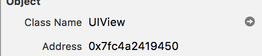
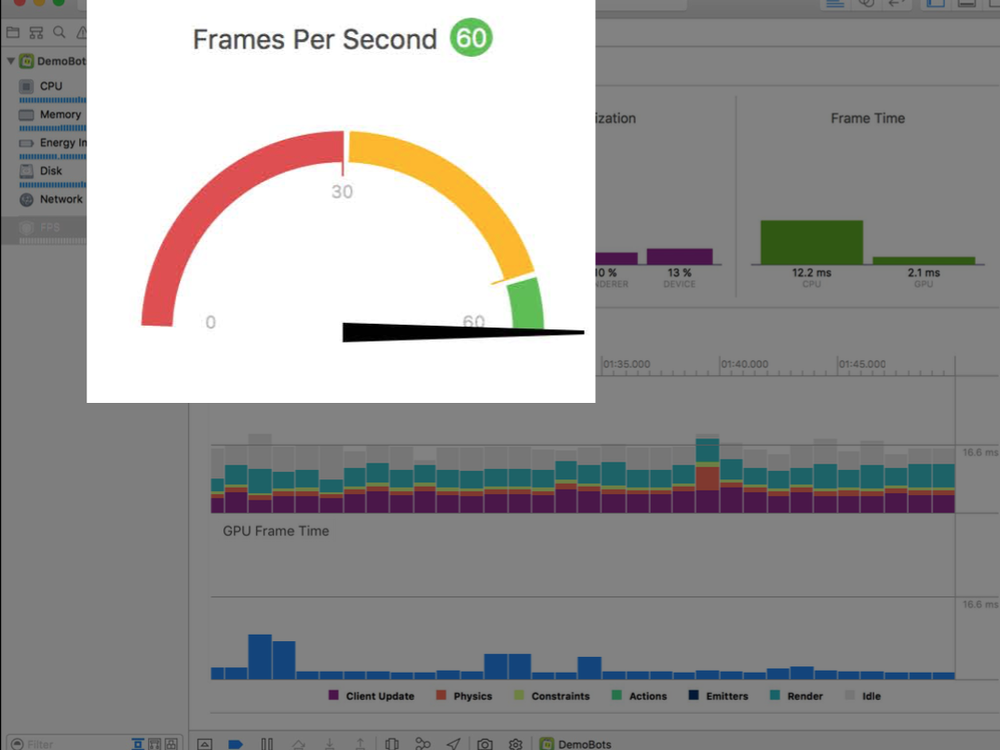

##                   Visual Debugging with xcode
主要分为以下几部分内容：

1. Runtime issues 
2. View debugging 
3. State machine Quick Looks 
4. SpriteKit/SceneKit FPS gauge 
5. Memory graph debugging 

### 一， Runtime issues
下面这些图标大家应该都很熟悉，编译error warning analyze 

现在新增了这个图标 Runtime issues 

这个不是oc中的Runtime问题，而是指app运行过程中产生的issue。 
例如，当多线程修改一个变量的时候会提示 

而会提示这样错误的包括三个地方 UI (AutoLayout)，内存(泄露)，线程 (竞态).

下面的内容是有关UI方面的。

### 二，view Debugging

先说说xcode上的变化，之前XIB是sizeClass的，可以在九宫格中选择如下图 

在xcode 8上就变成以下图这样，可以任意选择可观的设备以及横竖屏，更加真实 

除此之外，查看当前页面的布局，以前可以通过title，类名，父类名来查找，现在可以通过控件的 地址 来查找，也可以根据类名跳转到相应的类，

这块xcode8上不仅多了可以通过地址来查找，如果有约束冲突还会在runtime以及右侧中高亮显示，

另外快照速度也提高了70%比之前，对blur的支持也更完善。

### 三，Memory graph debugging

在 xcode 8上运行 iOS 10 以及以上的设备 会出现这个一个按钮，点击可以看到某一时刻内存中所有的class，点击class可以看出谁持有了这个类，如下列图中所示（这里假设只有一个根控制器FirstViewContrller从根控制器push过去添加SecondVC，并且设置SecondVC的block） 
 

 

从图中可以看出持有关系，利用这个当有循环引用的时候会很方便，如果查到是block或者timer引起的，点击右侧对应位置就可以跳到指定位置。

另外，如果没有被释放，还会有提示内存泄露。

如果打开了malloc stack，还可以在右边看到选中的类的内存创建过程，如下图 

### 四，SpriteKit/SceneKit FPS gauge

FPS 可以看到GPU和CPU的使用情况，方便我们去优化系统性能，突破一些瓶颈。

